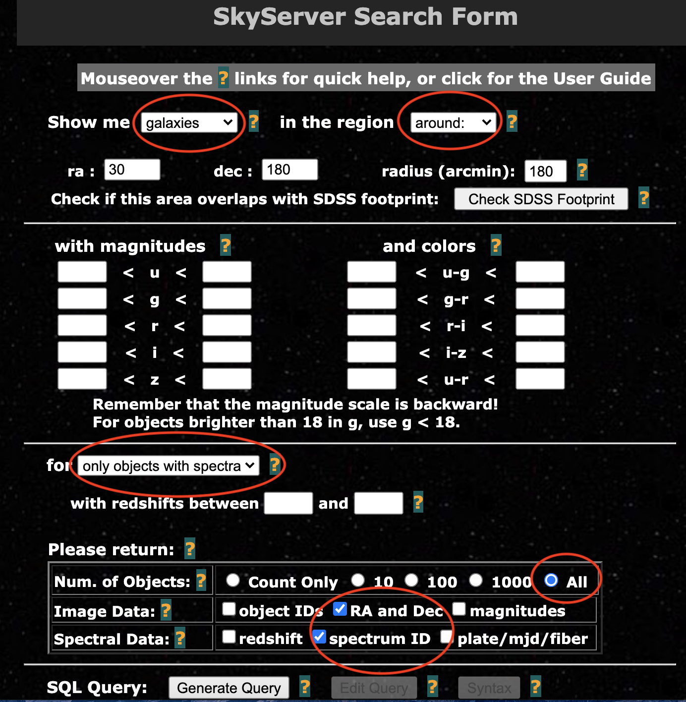
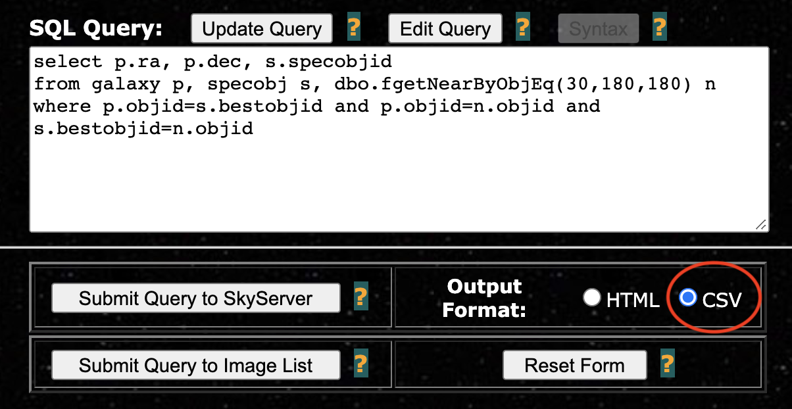
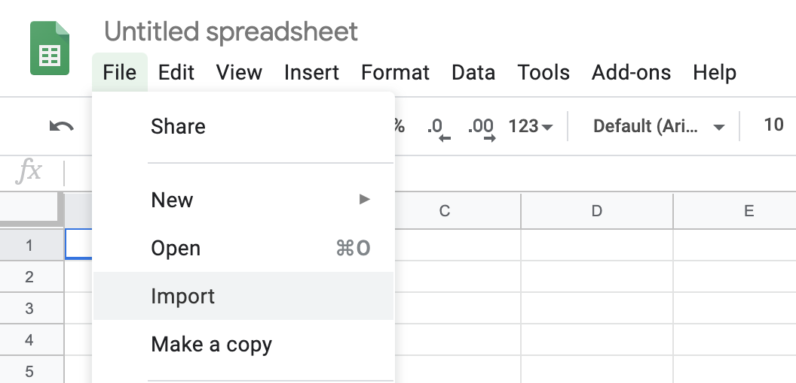
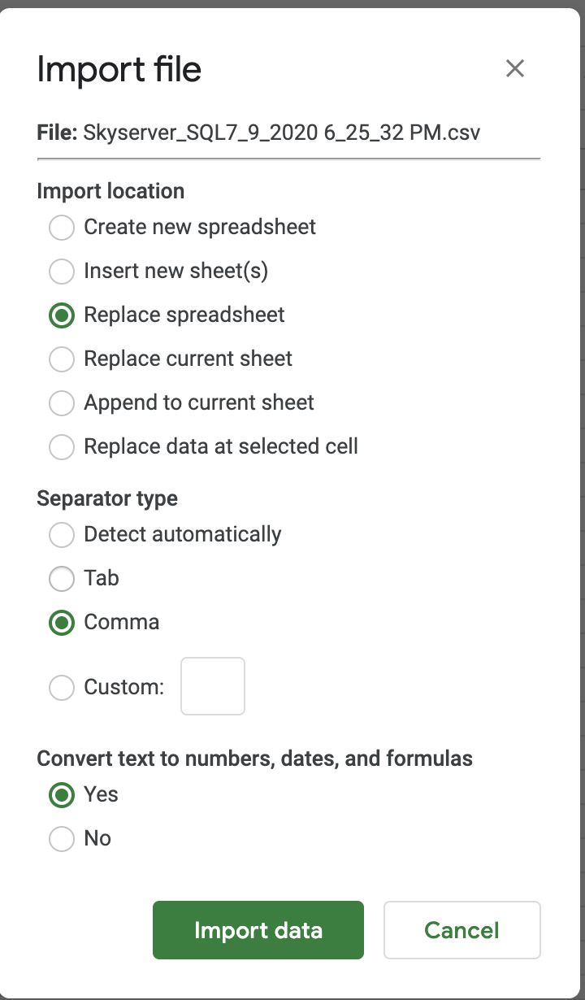
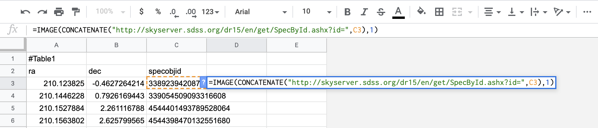
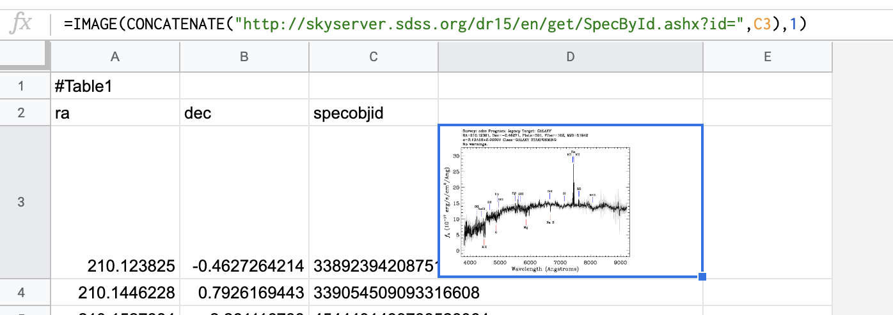

permalink:googlesheets_supplement

# A Supplement for My Research Note:

In my research note, I describe how to use Google sheets to display thousands of spectra from SDSS easily in Google Sheets. However, not everyone may be as familiar with how to data from SDSS and use Google Sheets, so this post is an attempt to be as explicit about these steps so that anyone, regardless of their familiarity with these processes, can still benefit from them.

## Part 1: Obtaining Data From SDSS

As I describe in my note, one can query the data from the [SDSS SkyServer Search Form](http://skyserver.sdss.org/dr16/en/tools/search/form/searchform.aspx). Below is a picture of an example query, in the event that I am looking for all galaxies with (RA, dec) = (30,180) within a radius of 180 arcminutes and which are associated with a spectrum.  I have circled in red all the options which must be manually changed to get the desired query.

Once all the appropriate boxes have been selected, hit "Generate Query" at the bottom of the page. Once the box has text in it, Skyserver is ready to be queried. Once you ensure that the output format is a CSV (image below), click "Submit Query to Skyserver" for the data to be downloaded to your computer.

## Part 2: Uploading the Data to Google Sheets

Once the data from the query has been downloaded, it can be put into [Google Sheets](https://www.google.com/sheets). The data can be uploaded as seen below:

After this step, the data should appear in columns in the spreadsheet. To implement the method in the note, simply click on a cell in the fourth column (such as D3) and paste the command as described in the note, making sure that the `SpecID` text is deleted and instead points to the cell containing the SpecID. It should appear as so:

Press the return key for the command to be entered:

Congratulations! You've got yourself a spectrum. The cells can be resized to see them better (as I do below). To apply it to all the other cells, click on the square at the bottom right corner of D3 and drag downwards. In case there are any issues, refer to the research note for troublehooting.
